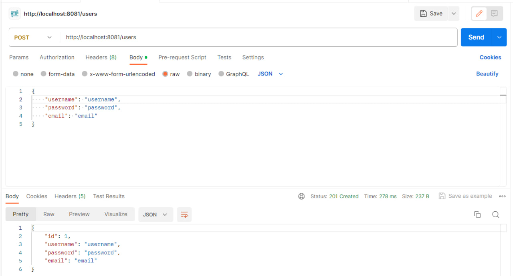
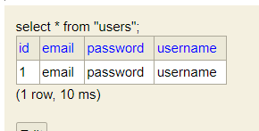
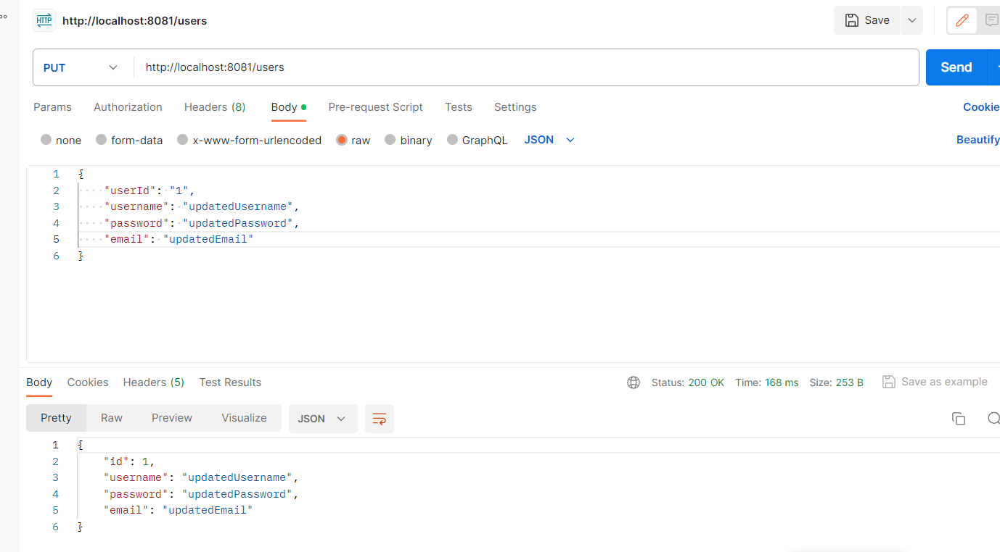
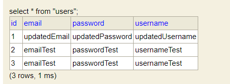
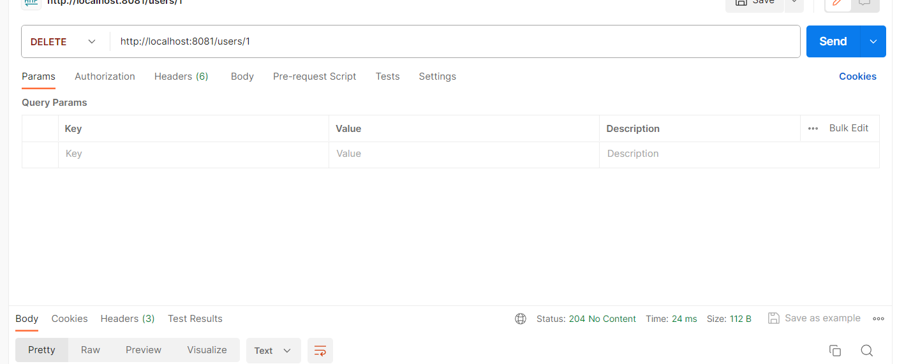
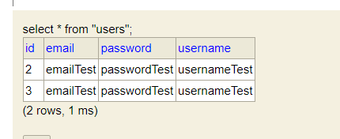
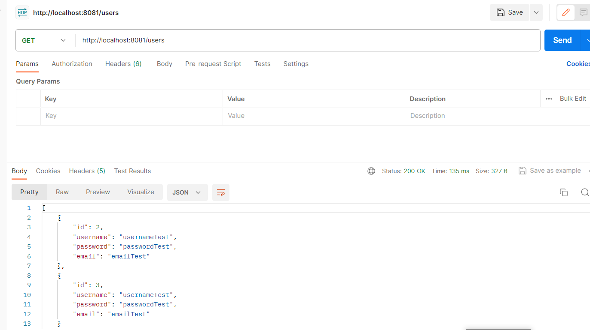
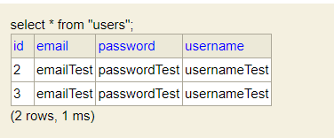
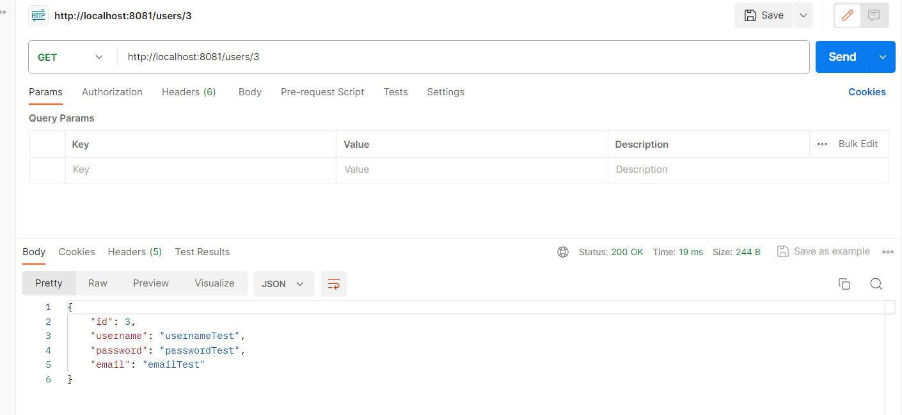
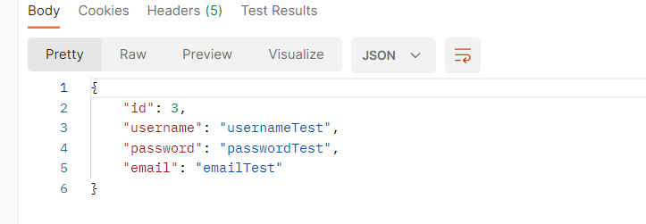

# Тестування працездатності системи

## POST User

#### Запит

#### Результат

## PUT User

#### Запит

#### Результат

## DELETE User

#### Запит

#### Результат

## GET ALL

#### Запит

#### Результат

## GET BY ID

#### Запит

#### Результат

